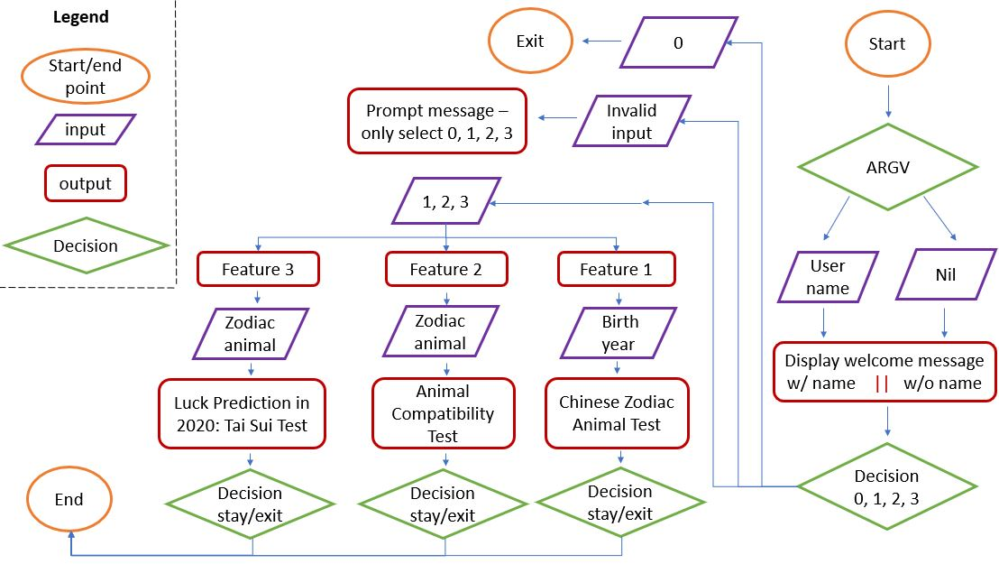

# GitHub

Pleas feel free to check out this project on GitHub: [Oriental Zodiac Patronus - GitHub](https://github.com/EllieChen-Git/terminal_app)

------

# Help

##### <u>How to Install & Use Oriental Zodiac Patronus</u>
Oriental Zodiac Patronus is a CLI application written in Ruby, which could be easily run on the command line. The whole program can be downloaded from GitHub (https://github.com/EllieChen-Git/terminal_app).

Users has the flexibility to receive a customised welcome message if they choose to enter their name when they try to run Oriental Zodiac Patronus in the terminal, e.g. 'ruby index.rb <u>user</u>'. Alternatively, a generic 'hi' message will display if there is no specific username input. 

##### <u>Dependencies required by Oriental Zodiac Patronus</u>
Before you start running Oriental Zodiac Patronus, you may wish to install Ruby Gems 'colorize' and 'artii' for better user experience. This can be simply done by enter 'gem install colorize' and 'gem install artii' on your command line.

##### <u>System/Hardware Requirements</u>
There is no specific system/hardware requirement for this application.

##### <u>Features of Oriental Zodiac Patronus</u>
- Feature 1 'Chinese Zodiac Animal Test' - Enter birth year and receive your Chinese zodiac animal
- Feature 2 'Animal Compatibility Test' - Enter your zodiac animal to see your best & worst animal matches
- Feature 3 'Luck Prediction in 2020: Tai Sui Test' - Enter your zodiac animal to predict your luck in 2020

------
# Software Development Plan – Oriental Zodiac Patronus

### <u>Statement of Purpose and Scope</u>
The purpose of Oriental Zodiac Patronus is to promote the idea of Chinese zodiac animals to users who either are not familiar with or have never heard of the Chinese horoscope. This application also serves as a fun and interactive game for people to play with their Chinese zodiac animals. 

The first option 'Chinese Zodiac Animal Test' provided by Oriental Zodiac Patronus is that users can check their Chinese zodiac animals by simply entering their birth years. After receiving the information from users, this CLI application will show users their current age and a brief description of their zodiac animals. The second option is 'Animal Compatibility Test', where users can use their zodiac animals as a reference to find out their animal compatibility, i.e. their best and worst matches. The third option 'Luck Prediction in 2020: Tai Sui Test' serves as an oriental fortune teller. With this option, users are able to use their zodiac animals to predict their luck in 2020, based on a Taoist concept 'Tai Sui' from the antient China. 

For users who already know their Chinese zodiac animals, this terminal application also offers the flexibility to skip the first option and go straight to 'Animal Compatibility Test' and 'Luck Prediction in 2020: Tai Sui Test'. Oriental Zodiac Patronus allows users to play games again and again until they decide to exit the program. In this case, users can use it to work out multiple people's (e.g. their family and friends) Chinese zodiac animals at once.

The target audience groups for this application are: 
- Zodiac fans who rely on zodiac signs interpretation in daily life but would like to try out something new, other than the mainstream Western horoscope system.
- People who are interested in Chinese culture and would like to learn more in a fun and interactive way.
- People who would like to introduce the concept of Chinese zodiac animals to people around them, where this application can be used as an excellent demonstration.

### <u>Features</u>

Below are the features of Oriental Zodiac Patronus:

- ##### <u>Feature 1 'Chinese Zodiac Animal Test' - Enter birth year and receive your Chinese zodiac animal</u>
This feature starts with a prompt to ask users for their birth year. This is a year format reminder 'yyyy' in the message to advise users not to input years with only 2 digits or in any other format. With this input, the program will (1) calculate the user's age by the 'age' variable ('age' equals to 2019 minus the birth year) and (2) produce the user's zodiac animal index number by the variable 'index', which is done through the modulus of 12 (as there are 12 Chinese zodiac animals). The 'index' variable will later be used to retrieve users' zodiac animal from the 'zodiac_animals' array to display the zodiac animal on the screen.

- ##### <u>Feature 2 'Animal Compatibility Test - Enter your zodiac animal to see your best & worst animal matches</u>  
This feature asks users to enter their 'Chinese zodiac animal'. With this input, the program is able to retrieve the variable 'index_2' of the 'zodiac_animals' array. With 'index_2', it can then show users they best matches (3 zodiac animals) and their worst match (1 zodiac animal). There are multiple 'if statements' involved as the index numbers cannot be larger than 11 (they should be in the range from 0 to 11).  

- ##### <u>Feature 3 'Luck Prediction in 2020: Tai Sui Test' - Enter your zodiac animal to predict your luck in 2020</u>  
This feature asks users to enter their 'Chinese zodiac animal'. With this input, the program is able to determine whether that zodiac animal will clash with Tai Sui in 2020, using an if/else statement.

- ##### <u>Other minor features</u>  
There is an optional customised welcome message with the implementation of 'ARGV'. If users choose to enter their name when they try to run Oriental Zodiac Patronus in the terminal, they will be greeted with their names. Otherwise, only a generic 'hi' message will display. 

Users can also choose to play Oriental Zodiac Patronus (Option 1, 2, 3) multiple times in any order until they decide to exit the program with Option 0. This is done through a while loop. A friendly reminder is placed at the end of the while loop so users will receive a warning message if they input is invalid (i.e. anything other than 0, 1, 2, 3).

### <u>User Interaction and Experience</u>

Oriental Zodiac Patronus was designed for the optimised user interface and experience. Once users start the app, it will retrieve their local time and greet them with different greetings depending on the time of the day. This helped personalise the user experience with Oriental Zodiac Patronus.

    Your current login time is 23:25 04/09/2019
    Good evening!

In the welcome message, a Ruby Gem 'colorize' was utilised to display each line of the message in different colours, and a 'sleep' method was implemented to create a 1-second timeout to make this section more vibrant.  

The menu section was displayed after the welcome message and users can choose the options with minimal entries (only number 0, 1, 2, 3), which provided a smooth user interface. The simplicity of the menu design avoided any confusion or hard-to-follow instructions, and therefore enhanced the user's experience when interacting with the app. A friendly reminder was also placed here to advise users only go straight to option 2 and 3 when they know their Chinese zodiac animal in advance.

If users choose option 1, the program will ask them for their birth year. To prevent any invalid entry, there was a year format reminder 'yyyy' in the message to advise users not to input years with only 2 digits or in any other formats. With Feature 1, the program will display users' age and their Chinese zodiac animal.

If users choose option 2, the program will ask them for their Chinese zodiac animal. With Feature 2, the program will display users' best matches and their worst match.

If users choose option 3, the program will ask them for their Chinese zodiac animal. With Feature 3, the program will predict users' luck in 2020 through the Tai Sui test. Here the program also displayed a brief description about the ideas of 'Tai Sui' and 'Fan Tai Shi' in Taoism, and how these would affect a person's luck in the coming year. This helped to improve users' understanding about Chinese zodiac animals and therefore enhanced their experience with Oriental Zodiac Patronus. There was also a tip provided if users' zodiac animal will clash with 'Tai Sui' in 2020, which was handy for users to avoid bad luck. 

### <u>Control Flow Diagram</u>

The below diagram can also be found on GitHub: [Oriental Zodiac Patronus - Control Flow Diagram](https://github.com/EllieChen-Git/terminal_app/blob/master/control_flow_diagram.JPG)

------
# Implementation Plan

The complete document with daily Trello screenshots attached can be found on GitHub: [Oriental Zodiac Patronus - Implementation Plan](https://github.com/EllieChen-Git/terminal_app/blob/master/implementation_plan.docx)

Also refer to Trello board for deadlines of each checklist items: [Oriental Zodiac Patronus - Trello board](https://trello.com/b/0OZdEWPF/oriental-zodiac-patronus)

| Features                                     | Checklists for Each Feature                                                                    | Priority Level| Estimated Duration|
| ---------------------------------------------| -----------------------------------------------------------------------------------------------| ------------- | ----------------- |
| <u>Feature 1 - Chinese Zodiac Animal Test</u>|                                                                                                |               |                   |
|                                              | 1. Ensuring if user selects option 1, the Feature 1 will run                                   | Medium        | 5 mins            |
|                                              | 2. Getting user input (birth year) and calculating user's age (using '2019 - birth year')      | Medium        | 5 mins            | 
|                                              | 3. Setting the 'Chinese zodiac animals' array in correct index order                           | High          | 15 mins           |
|                                              | 4. Working out user's zodiac animal by calculating the index of the array (using modulus of 12)| High          | 30 mins           |
|                                              | 5. Advising user of the characteristics of their zodiac animal                                 | Medium        | 15 mins           |
| <u>Feature 2 - Animal Compatibility Test</u> |                                                                                                |               |                   |
|                                              | 1. Ensuring if user selects option 2, the Feature 2 will run                                   | Medium        | 5 mins            |
|                                              | 2. Getting user input (zodiac animal)                                                          | Medium        | 5 mins            |
|                                              | 3. Working out user's best matches by soring the index pattern of the array                    | High          | 30 mins           |
|                                              | 4. Working out user's worst match by soring the index pattern of the array                     | High          | 30 mins           |
|                                              | 5. Ensuring each index number is less than 12 (i.e. it should start from 0 and end at 11)      | High          | 30 mins           |
| <u>Feature 3 - Luck Prediction in 2020</u>   |                                                                                                |               |                   |
|                                              | 1. Ensuring if user selects option 3, the Feature 3 will run                                   | Medium        | 5 mins            |
|                                              | 2. Briefly describing the concept of 'Tai Sui' for better user understanding                   | Law           | 10 mins           |                                  
|                                              | 3. Getting user input (zodiac animal)                                                          | Medium        | 5 mins            |
|                                              | 4. Setting up the animals that will clash with 'Tai Sui' in 2020                               | High          | 5 mins            |                                  
|                                              | 5. Writing message for both animal groups                                                      | Law           | 10 mins           |      

------
# Status Updates/Development Log

- ##### <u>03-09-2019 Status Update 1 – Coding</u>
First day of working on my first project at the bootcamp, felt a bit lost with the assessment criteria as it seemed like a lot for a single terminal application. I decided to take my time breaking down each requirement and I did feel much better after I did so. 

My goal today was finishing the major features of the code (other minor features could be further added if I have time afterwards), and I did it! One of the major difficulties I encounter was how to make my code 'dryer'. I tried to use the case statement first (it definitely shortened my code than using a big chunk of if/elsif/else statement), but later I realised that one single variable with the array index actually solved the issue perfectly with the instructions from the teachers. The other issue I encountered with was how to use the while loop correctly so that user could choose to continue with the game until they decided to leave. I was very happy that I did complete the majority of the app today (at least it runs without an error).

- ##### <u>04-09-2019 Status Update 2 – Documentation</u>
I completed the control flow diagram and the implementation plan, and continuously used Trello and GitHub to track the progress of my project. The major issue for me today was that I spent too much time drawing the control flow diagram, while aiming at finishing the software development plan today. Needed to push myself harder and hope I'd be on track soon.

- ##### <u>05-09-2019 Status Update 3 – Polishing the project</u>
My goal today was to complete help file, spelling check and slides for presentation. Also, I devoted some time to do further code testing and improve the error handling in my app.

# Application Testing

The complete testing procedure and cases can be found on GitHub: [Oriental Zodiac Patronus - Application Testing](https://github.com/EllieChen-Git/terminal_app/blob/master/manual_testing_log.xlsx)

Ellie Chen @2019